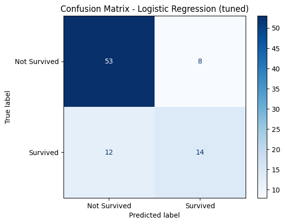
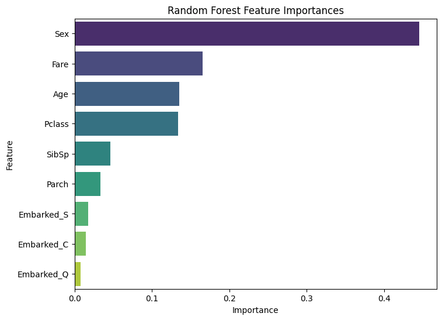

# Titanic Survival Prediction

This project predicts passenger survival on the Titanic using **Logistic Regression** and **Random Forest Classifier**, showcasing data preprocessing, model evaluation, and feature importance visualization.

---

## 📊 Project Overview

The goal is to build a predictive model to determine which passengers survived the Titanic disaster based on passenger features.  
This project demonstrates:

- Data loading, exploration, and cleaning
- Handling missing values
- Encoding categorical variables
- Feature scaling for Logistic Regression
- Model training and evaluation
- Visualizing confusion matrices and feature importances
- Comparing model outputs and feature importance
- Cross-validation for Random Forest
  
---

## 🗂 Dataset

The dataset comes from the [Kaggle Titanic competition](https://www.kaggle.com/c/titanic/data), containing features like:

- PassengerId, Pclass, Name, Sex, Age, SibSp, Parch, Ticket, Fare, Cabin, Embarked with the Target variable being `Survived` (0 = did not survive, 1 = survived).

**Preprocessing steps:**

- Dropped irrelevant columns: `Name`, `Ticket`, `Cabin`, `PassengerId`
- Filled missing `Age` values with the median
- Filled missing `Embarked` values with the mode (`S`)
- Encoded `Sex` (male = 0, female = 1) and used one-hot encoding for `Embarked`
- Scaled features for Logistic Regression

---

## 🧠 Models Used

### Logistic Regression
- Used to analyze the impact of each feature on survival
- Positive coefficients indicate features increasing survival chances
- Negative coefficients indicate features decreasing survival chances
- Produces a confusion matrix visualization

### Random Forest Classifier
- Provides feature importance to understand which features influence predictions the most
- Does not require feature scaling
- Includes cross-validation for robustness
  
---

## 📈 Evaluation Metrics

- **Accuracy**: measures overall model correctness
- **Confusion Matrix**: shows true positives, false positives, true negatives, false negatives
- **Classification Report**: precision, recall, f1-score

Example outputs:
 - Accuracy: 0.81
 - Classification reports are printed in the console
 - Confusion Matrix (Logistic Regression):


---

## 🔍 Feature Importance

### Logistic Regression Coefficients
- Positive: increase survival chance  
- Negative: decrease survival chance 
- Top positive and negative features are printed in the console.

### Random Forest Feature Importance



- Shows the most and least influential features

---

## 📝 Conclusion
Logistic Regression highlights that being female, paying a higher fare, and traveling in first class increased survival chances, while age and traveling in larger families decreased it. Random Forest confirms these insights and shows which features are most important for predictions.

## 📂 File Structure
```
titanic-survival-prediction/
│
├── train.csv                    # Original Titanic dataset
├── titanic_survival.py          # Python script with preprocessing, modeling, and evaluation
├── outputs/                     # Generated outputs
│   ├── confusion_lr.png         # Logistic Regression confusion matrix
│   └── rf_feature_importance.png # Random Forest feature importance plot
└── README.md
```
---

## 💻 How to Run

1. Clone the repository by pasting this code in bash:
  git clone https://github.com/yourusername/titanic-survival.git
  cd titanic-survival

2.Install dependencies needed to run this code by pasting this code in bash afterwards:
  pip install pandas scikit-learn seaborn matplotlib

3.Run the script using the bash:
  python titanic_survival.py

## 📌 Notes

Random Forest cross-validation score is printed at the end of the script.
The /outputs folder ensures all visualizations are saved and not overwritten in case you're running the code on local and didn't install the /outputs folder.
Feel free to modify train_test_split or Random Forest hyperparameters for experimentation.
