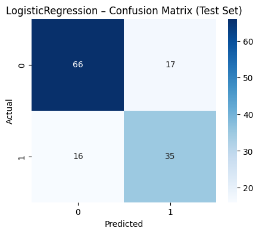
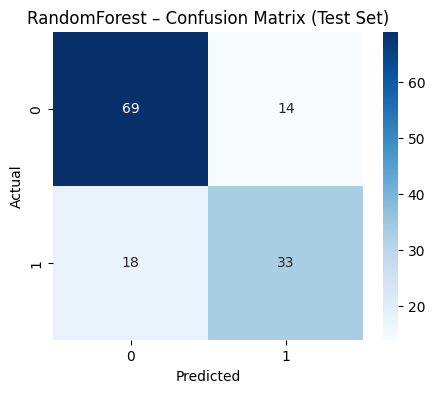

# Titanic Survival Prediction


[](https://github.com/plsjustwork/titanic-survival-prediction/actions)


Predict passenger survival using classical machine learning models (Logistic Regression & Random Forest) in a fully reproducible pipeline powered by GitHub Actions.
Includes preprocessing, encoding, feature engineering, model training, evaluation, and automated output saving.

---

## 📊 Project Overview & Goals

This project builds predictive models to determine Titanic passenger survival based on passenger features.
Updates from previous version include:

- Modular & scalable Python architecture
- Clean preprocessing pipeline (encoding, scaling, missing values)
- Optional outlier removal (applied only to training data)
- Train/validation/test splitting
- Model comparison with metrics & confusion matrices
- Automated saving of all outputs in outputs/
- GitHub Actions CI + DVC-ready workflow
- Pytest test suite
  
---

## 🗂 Dataset

The dataset comes from the [Kaggle Titanic competition](https://www.kaggle.com/c/titanic/data), containing features like:

- PassengerId, Pclass, Name, Sex, Age, SibSp, Parch, Ticket, Fare, Cabin, Embarked with the Target variable being `Survived` (0 = did not survive, 1 = survived).

**Preprocessing steps:**

- The preprocessing pipeline includes:

  - Missing-value imputation
  - Numeric scaling
  - One-hot encoding of categorical features
  - Optional outlier removal (done only on training set in main.py)
    
---

## 🧠 Models Used

### Logistic Regression

- Tuned via GridSearchCV (C, penalty)
- Standardized feature inputs
- Outputs:
  - Validation accuracy: 0.784
  - Test accuracy: 0.754
  - Confusion matrix:
 
  
    
### Random Forest Classifier

- Hyperparameter tuning via GridSearchCV
- Outputs:
  - Validation accuracy: 0.799
  - Test accuracy: 0.761
  - Confusion matrix:

  
---

## 📈 Evaluation Metrics

- Implemented in evaluation.py:

  - Accuracy
  - Classification report (precision, recall, F1)
  - Confusion matrix (with heatmap plot saved to outputs/)
  - Side-by-side model comparison table
  - Feature importance (RF) + coefficients (LR) printed for interpretability
  
## 📂 File Structure
```
titanic-survival-prediction/
│
├── data/
│   └── titanic.csv
│
├── src/
│   ├── loader/
│   │   └── load_data.py
│   ├── functions/
│   │   ├── models/
│   │   │   ├── lr_model.py
│   │   │   ├── rf_model.py
│   │   │   └── evaluation.py
│   │   ├── feature_engineering.py
│   │   └── preprocessing.py
│
├── main.py              # full pipeline execution
├── outputs/             # auto-generated metrics & plots 
├── tests/               # pytest suite
└── requirements.txt

```
---

## 💻 How to Run

```bash
# 1. clone repository
git clone https://github.com/plsjustwork/titanic-survival-prediction.git
cd titanic-survival-prediction

# 2. create & activate environment
python -m venv .venv
source .venv/bin/activate        # Windows: .venv\Scripts\activate

# 3. install dependencies
pip install -r requirements.txt

# 4. run pipeline
python main.py

# 5. (optional) run tests & linting
pytest
flake8

```
## 📌 Notes
- The outputs/ folder ensures all plots and metrics are saved automatically
- Removing outliers is optional; can experiment with different thresholds
- Hyperparameter tuning can be modified for experimentation and cross-validation could be added as well.
- LR coefficients vs RF feature importance comparison printed in console for deeper analysis
