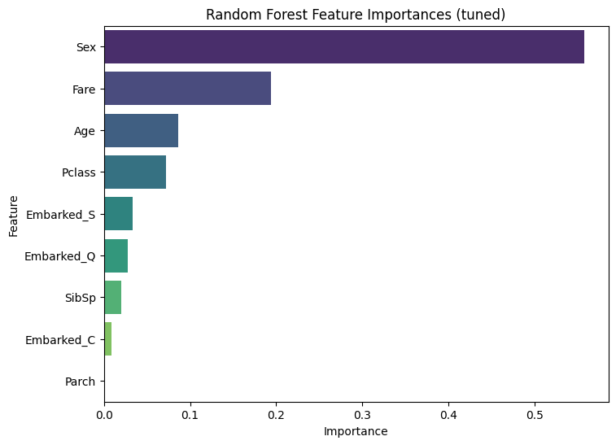

# Titanic Survival Prediction


[](https://github.com/plsjustwork/titanic-survival-prediction/actions)

Predict passenger survival with classical ML (Logistic Regression, Random-Forest) in a fully-reproducible pipeline powered by GitHub Actions. Includes data preprocessing, model evaluation, hyperparameter tuning, cross-validation, feature importance, and SHAP explainability. All outputs are saved automatically in `outputs/`.

---

## 📊 Project Overview

This project builds predictive models to determine Titanic passenger survival based on passenger features.
Updates from previous version include:

- Removal of outliers from numeric features
- Hyperparameter tuning for Logistic Regression and Random Forest
- Cross-validation for Random Forest
- SHAP summary plots for feature importance
- Validation curves for Random Forest depth
- Comparison of LR coefficients vs RF importance
  
---

## 🗂 Dataset

The dataset comes from the [Kaggle Titanic competition](https://www.kaggle.com/c/titanic/data), containing features like:

- PassengerId, Pclass, Name, Sex, Age, SibSp, Parch, Ticket, Fare, Cabin, Embarked with the Target variable being `Survived` (0 = did not survive, 1 = survived).

**Preprocessing steps:**

- Dropped irrelevant columns: `Name`, `Ticket`, `Cabin`, `PassengerId`
- Filled missing `Age` values with the median
- Filled missing `Embarked` values with the mode (`S`)
- Standardized features for Logistic Regression
- Outliers removed based on IQR method

---

## 🧠 Models Used

### Logistic Regression

- Tuned with 5-fold GridSearchCV for C and penalty
- Standardized features
- Outputs:
  - Validation accuracy: 0.851
  - Test accuracy: 0.770
  - Confusion matrix:
    
    
    
  - Top positive coefficients: Sex (0.970), Fare (0.303)
  - Top negative coefficients: Pclass (-0.143), Embarked_S (-0.089)

### Random Forest Classifier

- Hyperparameter tuning via GridSearchCV
- Validation curve for max_depth
 


- Cross-validation score on training fold: 0.814
- Outputs:
  - Validation accuracy: 0.851
  - Test accuracy: 0.793
  - Confusion matrix
     
  
  
  - Feature importance
     
  
  
  - Most important features: Sex, Fare, Age
  
---

## 🔍 SHAP Explainability

- TreeExplainer on Random Forest
- SHAP summary plot:
  


- Shows feature-level impact on predictions
- Confirms Sex and Fare as top contributors to survival prediction
  
---

## 📈 Evaluation Metrics

- Accuracy: overall model performance
- Classification Report: precision, recall, f1-score
- Confusion Matrix: true positives, false positives, etc.
- Cross-Validation Score: for Random Forest
Example outputs:

| Model               | Validation Accuracy | Test Accuracy | CV Score (if applicable) |
| ------------------- | ------------------- | ------------- | ------------------------ |
| Logistic Regression | 0.851               | 0.770         | -                        |
| Random Forest       | 0.851               | 0.793         | 0.814                    |

- Confusion matrices and LR vs RF comparison printed in console
- Cross-validation confirms Random Forest generalizes well
  
---

## 📝 Conclusion
- Logistic Regression confirms that being female, traveling in first class, and higher fare increase survival chance
- Age, larger families, and being male reduce survival chance
- Random Forest and SHAP plots provide consistent feature importance insights
- Outlier removal and hyperparameter tuning improved model performance
- Cross-validation shows RF is robust and avoids overfitting

## 📂 File Structure
```
titanic-survival-prediction/
│
├── train.csv, test.csv        # Kaggle data (DVC-tracked)
├── titanic.py                 # end-to-end script (pipeline)
├── outputs/                   # auto-generated plots & metrics (created by script)
├── tests/                     # pytest suite
└── requirements.txt
```
---

## 💻 How to Run

```bash
# 1. clone & enter
git clone https://github.com/plsjustwork/titanic-survival-prediction.git
cd titanic-survival-prediction

# 2. create environment
python -m venv .venv && source .venv/bin/activate  # Win: .venv\Scripts\activate
pip install -r requirements.txt

# 3.Run the script using the bash:
python titanic.py

# 4. (optional) run tests & linting
pytest
flake8
```
## 📌 Notes

- The outputs/ folder ensures all plots and metrics are saved automatically
- Removing outliers is optional; can experiment with different thresholds
- Hyperparameter tuning and cross-validation can be modified for experimentation
- LR coefficients vs RF feature importance comparison printed in console for deeper analysis
